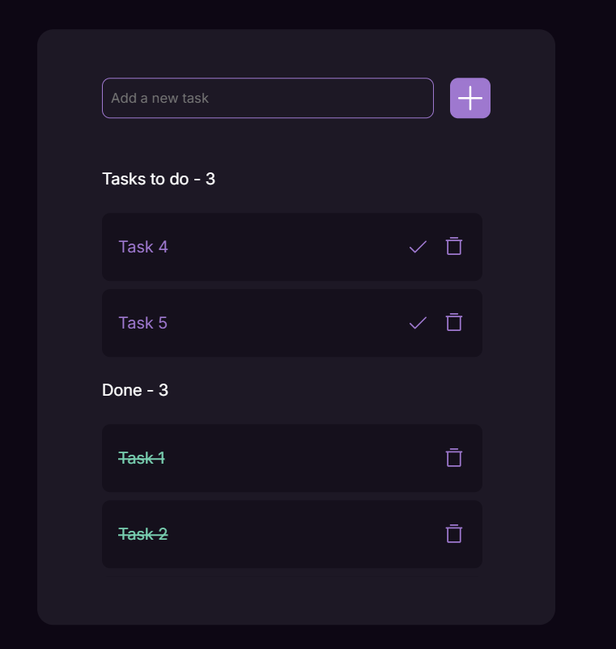

<h1>React Todo App</h1>

A simple to-do list app made with React. You can easily add, edit, and remove tasks to help you stay organized.

<h3>Features</h3>
<ul>
  <li><strong>Add Tasks:</strong> Create new tasks with descriptions.</li>
 
  <li><strong>Delete Tasks:</strong> Remove tasks that are no longer needed.</li>
  <li><strong>Mark Tasks as Completed:</strong> Toggle between completed and pending tasks.</li>
 
</ul>

<h3>Technologies Used</h3>
<ul>
  <li><strong>React.js:</strong> The core library for building the user interface.</li>
  <li><strong>JavaScript (ES6+):</strong> For functionality and app logic.</li>
  <li><strong>CSS:</strong> For styling the app and making it responsive.</li>
</ul>

<h3>Installation</h3>
<ol>
  <li><strong>Clone the repository:</strong> Run the following command to clone the project to your local machine:
    <pre><code>git clone https://github.com/abdrahmanayach/react-todo-app.git</code></pre>
  </li>
  <li><strong>Navigate to the project directory:</strong> Change into the project folder:
    <pre><code>cd react-todo-app</code></pre>
  </li>
  <li><strong>Install dependencies:</strong> Install the required dependencies using npm:
    <pre><code>npm install</code></pre>
  </li>
  <li><strong>Start the development server:</strong> Run the following command to start the app locally:
    <pre><code>npm run dev</code></pre>
  </li>
</ol>
